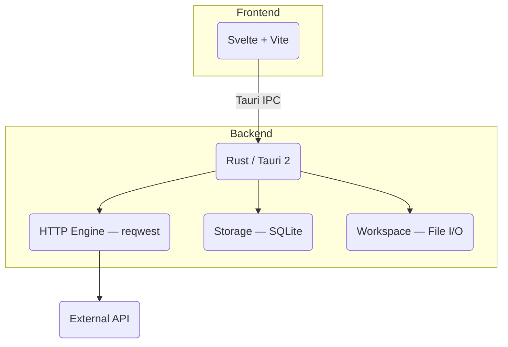

# Ryu

**A fast, local-first API testing tool built with Rust, Tauri, and Svelte.**

Ryu is a lightweight desktop application for all your API testing needs. A developer-focused alternative to Postman and Insomnia — simple, fast, and completely offline.

---

### Built with


---

## Why Ryu?

Modern API clients are bloated, slow, and cloud-dependent. Ryu is the opposite.

- **No Cloud, No Accounts** — everything stays on your machine
- **Fast and Lightweight** — Rust + Tauri, not Electron
- **Git-Friendly** — save requests as plain JSON files
- **Simple and Focused** — just what you need, nothing else

---

## Features

| Feature                  | Description                                                                          |
| ------------------------ | ------------------------------------------------------------------------------------ |
| **All HTTP Methods**     | `GET`, `POST`, `PUT`, `DELETE`, `PATCH`                                              |
| **Full Request Control** | URL, parameters, headers, body                                                       |
| **Multiple Auth Types**  | Bearer Token, API Key, Basic Auth                                                    |
| **Response Viewer**      | Status, timing, size, headers, pretty-printed JSON                                   |
| **Request History**      | SQLite-backed, click to reload                                                       |
| **Environment Variables**| `{{VARIABLE}}` syntax, stored in SQLite                                              |
| **Collections**          | Organize requests in folders, import/export as JSON                                  |
| **File-Based Requests**  | Save and load requests as portable JSON files                                        |
| **cURL Export**          | One-click cURL generation                                                            |
| **Dark / Light Theme**   | Toggle in the sidebar header                                                         |
| **Keyboard Shortcuts**   | `Ctrl+Enter` send, `Ctrl+S` save, `Ctrl+O` open, `Ctrl+B` sidebar                  |

---

## Quick Start

### Prerequisites

- **Rust** 1.77.2+: [rustup.rs](https://rustup.rs/)
- **Node.js** 18+: [nodejs.org](https://nodejs.org/)
- **Linux only** — system deps:
  ```bash
  sudo apt install libwebkit2gtk-4.1-dev libssl-dev libgtk-3-dev libayatana-appindicator3-dev librsvg2-dev
  ```

### Run

```bash
git clone https://github.com/dev-Ninjaa/ryu.git
cd ryu
npm install        # or: bun install
npm run tauri:dev  # or: bun tauri dev  or: cargo tauri dev (from root)
```

### Build

```bash
npm run tauri:build  # or: bun tauri build
```

Output: `src-tauri/target/release/bundle/`

---

## How to start the app

| Command | What it does |
|---|---|
| `npm run tauri:dev` | Installs deps, starts Vite, launches the desktop window |
| `bun tauri dev` | Same, using Bun |
| `cargo tauri dev` (from root) | Same, using Cargo's Tauri CLI |

All three commands first start the Vite dev server (`npm run dev` / `bun dev`), then compile the Rust backend and open the window.

---

## Architecture



---

## Documentation

| File | Description |
|---|---|
| [ARCHITECTURE.md](docs/ARCHITECTURE.md) | Technical architecture and data flow |
| [BUILD.md](docs/BUILD.md) | Full build guide |
| [CHANGELOG.md](docs/CHANGELOG.md) | Version history |
| [ENV_VARIABLES_GUIDE.md](docs/ENV_VARIABLES_GUIDE.md) | Environment variable usage |
| [FILE_SAVE_LOAD_GUIDE.md](docs/FILE_SAVE_LOAD_GUIDE.md) | Save/load requests as JSON |
| [QUICKSTART.md](docs/QUICKSTART.md) | Quick start |
| [RUN.md](docs/RUN.md) | Running the app |
| [SETUP_INSTRUCTIONS.md](docs/SETUP_INSTRUCTIONS.md) | Dev environment setup |

---

## License

MIT — see [LICENSE](LICENSE).
